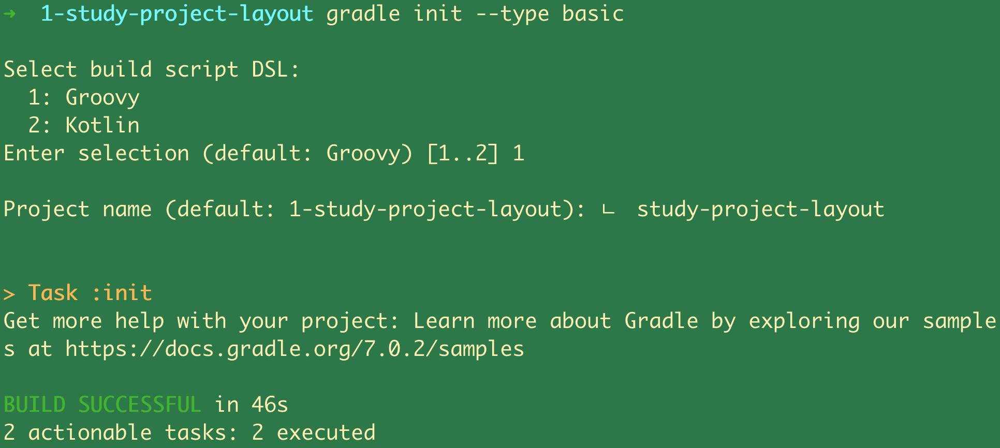
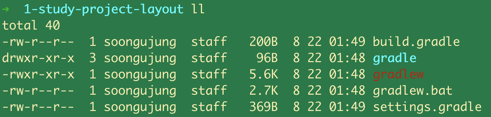

## 2. 기본속성과 프로젝트 레이아웃 구성 - gradle init 명령, settings.gradle


## 참고자료

- [엔터프라이즈 빌드 자동화를 위한 Gradle, 윤석진 저, 한빛미디어](http://www.yes24.com/Product/Goods/20052289)

<br>

## 예제용도 디렉터리 생성

```bash
$ mkdir 1-study-project-layout
$ cd 1-study-project-layout
```

<br>

## gradle init

init 명령은 아래의 다섯가지 타입들을 지원한다. (Java-library 는 자바 프로젝트 구성시에 사용한다. 3장에서 확인가능)<br>

이번 예제에서는 아래의 초기화 명령 중 Basic 타입을 사용한 예제를 살펴본다.<br>

- Basic
- Groovy-library
- Java-library
- Pom
- Scala-library

<br>

## 기본 프로젝트 구성하기

프로젝트를 구성하는 명령은 init 명령이다.

```bash
$ gradle init --type basic
```

<br>



캡처사진에 ㄴ 글자가 입력되어 있는데 실수로 한글이 입력되어서 입력된 문자다.

<br>

## 기본으로 생성되는 파일들

ls -al 명령어로 생성된 파일들을 확인해보면 아래와 같다.



<br>

**gradlew, gradlw.bat**

gradlew, gradlew.bat 파일은 보통 wrapper 파일이라고 부른다. 다른 개발 PC에서 프로젝트를 다운받아 사용하는 사용자가 PC에 gradle을 설치하지 않았더라도 실행할 수 있도록 해준다. 즉, gradle 을 설치하지 않은 다른 사용자는 gradlew 를 사용해 gradle 명령을 수행할 수 있다.<br>

이렇게 gradle 명령이 wrapping 된 파일에 대한 설정은 'gradle/wrapper/gradle-wrapper.properties' 에 정의되어 있다.<br>

<br>

**settings.gradle**

멀티 프로젝트를 구성하는 데 사용되는 파일<br>

<br>

**build.gradle**

gradle 을 사용할 때 가장 중요하고 기본이 되는 파일<br>

<br>

## settings.gradle

Gradle 프로젝트의 org.gradle.api 패키지에는 Project 인터페이스가 있다. build.gradle 파일을 수정해서 빌드를 할 때 Project 인터페이스의 API 와 상호작용한다.<br>

Gradle 초기화 시 build.gradle, settings.gradle 파일이 생성되었었다. settings.gradle 은 Settings 인스턴스가 읽어들이는 파일이다.(Gradle 내부 소스에는 Settings 인터페이스가 있다.) Settings 인터페이슨느 settings.gradle 파일을 기본 설정파일로 읽고 해당 파일을 참조해 현재 프로젝트가 멀티프로젝트인지 싱글 프로젝트인지 판별한다.<br>

<br>