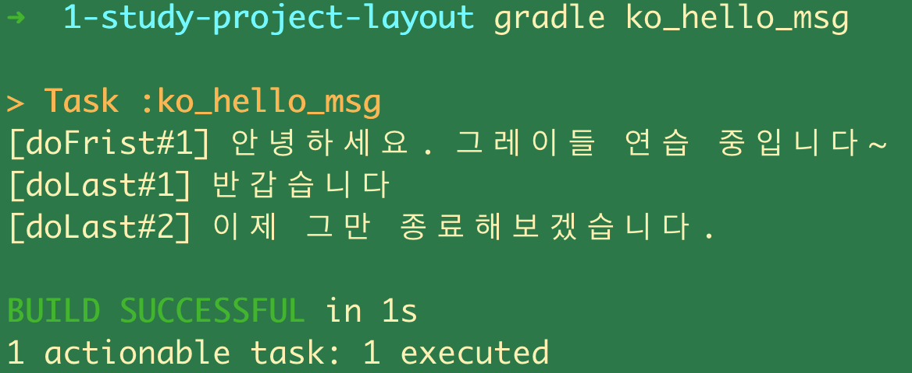
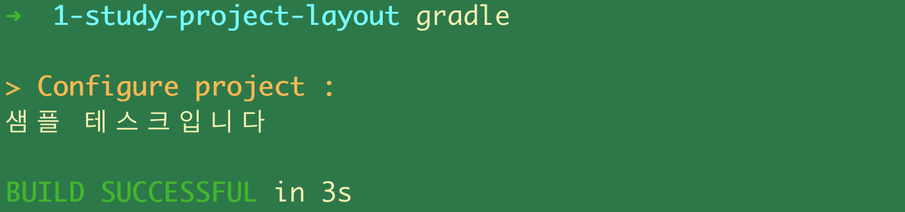

# 3. 기본속성과 프로젝트 레이아웃 구성 - Task 실행 순서 제어하기 : doFirst, doLast, 디폴트 Task 지정하기

## 참고자료

[엔터프라이즈 빌드 자동화를 위한 Gradle, 윤석진 저, 한빛미디어](http://www.yes24.com/Product/Goods/20052289)<br>

<br>

## << 연산자

참고) << 연산자라는 것이 있는데 이 연산자는 Gradle 4.x 까지만 사용가능하다.<br>

https://stackoverflow.com/questions/55793095/could-not-find-method-leftshift-for-arguments-after-updating-studio-3-4<br>

예를 들어 아래와 같은 build.gradle 소스가 있다고 해보자.<br>

```groovy
task run << {
    println 'running now'
}

task ko_hello_msg{
    println '안녕하세요. 그레이들 연습중입니다~'
}
```

위의 경우 Gradle 4.x 까지만 사용가능하다. << 연산자는 가장 나중에 실행하겠다는 연산자인데, Gradle 4.x 에서는 Deprecated 되었고, 5.0 에서는 제거되었다.<br>

## First, Last 연산자

그레이들의 Task 인터페이스에는 doLast(), doFirst() 메서드가 있다.<br>

참고 : docs.gradle.org<br>

https://docs.gradle.org/current/javadoc/org/gradle/api/Task.html<br>

<br>

예제

```groovy
task ko_hello_msg{
    description = '한글로 인사하는 태스크'

    doLast {
        println '[doLast#1] 반갑습니다'
    }
    doFirst {
        println '[doFrist#1] 안녕하세요. 그레이들 연습 중입니다~'
    }
    doLast {
        println '[doLast#2] 이제 그만 종료해보겠습니다.'
    }
}
```

<br>

출력결과



doFirst 를 먼저 실행한다. 그리고 doLast 두개를 실행한다. doLast 중 doLast#1 이 먼저 정의되었기 때문에 doLast#1 을 먼저 출력하게 되었다.<br>

<br>

## 디폴트 Task 지정하기

Gradle 은 기본으로 실행할 Task 를 지정할 수 잇다. 이것을 디폴트 태스크라고 부른다. 디폴트 태스크를 정의하면, gradle 명령 만 입력해도 해당 디폴트 태스크는 태스크명 지정 없이 gradle 명령만 실행해도 실행할 수 있다.<br>

예제) defaultTask 로 "explain_task" 를 지정했다.<br>

```groovy
defaultTasks 'explain_task'

task explain_task{
    println '샘플 테스크입니다'
}

task ko_hello_msg{
    description = '한글로 인사하는 태스크'

    doLast {
        println '[doLast#1] 반갑습니다'
    }
    doFirst {
        println '[doFrist#1] 안녕하세요. 그레이들 연습 중입니다~'
    }
    doLast {
        println '[doLast#2] 이제 그만 종료해보겠습니다.'
    }
}
```

<br>

이제 아래의 명령어를 입력해보자.

```bash
$ gradle
```

<br>

출력결과

