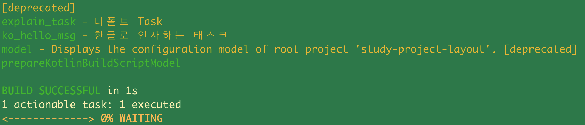

# 4. 기본속성과 프로젝트 레이아웃 구성 - Task 실행 순서 제어하기 : 태스크 설명 추가하기

## 참고자료

[엔터프라이즈 빌드 자동화를 위한 Gradle, 윤석진 저, 한빛미디어](http://www.yes24.com/Product/Goods/20052289)<br>

<br>

## build.gradle

이전에 사용했던 빌드 스크립트 build.gradle 을 아래와 같이 수정하자. 

```groovy
defaultTasks 'explain_task'

task explain_task(description: '디폴트 Task'){
    println '샘플 테스크입니다'
}

task ko_hello_msg(description: '한국말로 설명하는 Task'){
    description = '한글로 인사하는 태스크'

    doLast {
        println '[doLast#1] 반갑습니다'
    }
    doFirst {
        println '[doFrist#1] 안녕하세요. 그레이들 연습 중입니다~'
    }
    doLast {
        println '[doLast#2] 이제 그만 종료해보겠습니다.'
    }
}
```

<br>

결과확인하기

```bash
$ gradle tasks --all
```

<br>

출력결과



